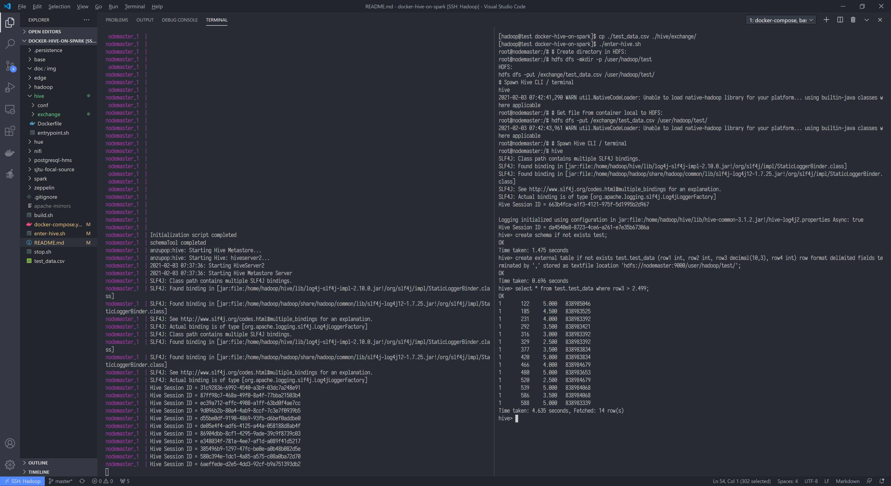
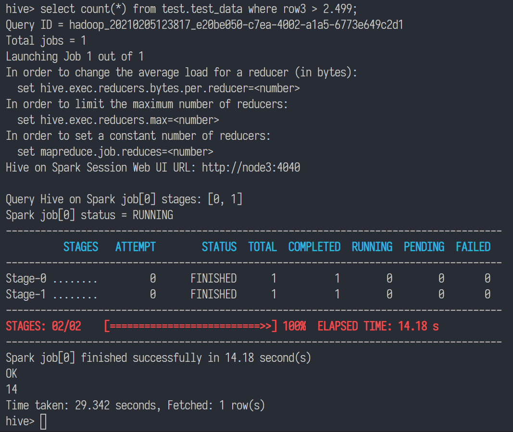

# docker-hive-on-spark

Hive on Spark, with Docker (compose). (Experimental)

Based on [this](https://github.com/sciencepal/dockers/).

**WARNING**: these images [ come | are shipped ] with pre-included ssh keys. Though no ssh service is exposed to the public, it's suggested to regenerate keys for all your services.

## Highlights

* Hive on Spark is enabled by default.
* `./hive/exchange` for hive data exchange.
* All configuration files are mounted into container.

## Usage

### Build

```bash
./build.sh
```

#### Mirrors

[SJTUG Mirrors](https://mirrors.sjtug.sjtu.edu.cn/) for Ubuntu Focal mirrors.

[Tongji Open Source Software Mirror](https://mirrors.tongji.edu.cn/) for Apache mirrors.

You may change it yourself in `Dockerfile`s.

#### Tag

You may want to use your own tag. Just remember to change all corresponding occurrences in `Dockerfile`s and other related files.

### Start

* run `build.sh` to build your own images.

```bash
docker-compose up
```

### Enter Hive

```bash
./enter-hive.sh
```

### Stop

```bash
./stop.sh
```

## Test

### General

After hive initialization complete:

```bash
cp ./test_data.csv ./hive/exchange/
./enter-hive.sh
```

in container:

```bash
# Create directory in HDFS:
hdfs dfs -mkdir -p /user/hadoop/test
# Get file from container local to HDFS:
hdfs dfs -put /exchange/test_data.csv /user/hadoop/test/
# Spawn Hive CLI / terminal
hive
```

in Hive CLI / terminal:

```sql
create schema if not exists test;
create external table if not exists test.test_data (row1 int, row2 int, row3 decimal(10,3), row4 int) row format delimited fields terminated by ',' stored as textfile location 'hdfs://nodemaster:9000/user/hadoop/test/';
select * from test.test_data where row3 > 2.499;
```

output:

```sql
-- non-hive output snipped
hive> create schema if not exists test;
OK
Time taken: 1.475 seconds
hive> create external table if not exists test.test_data (row1 int, row2 int, row3 decimal(10,3), row4 int) row format delimited fields terminated by ',' stored as textfile location 'hdfs://nodemaster:9000/user/hadoop/test/';
OK
Time taken: 0.696 seconds
hive> select * from test.test_data where row3 > 2.499;
OK
1       122     5.000   838985046
1       185     4.500   838983525
1       231     4.000   838983392
1       292     3.500   838983421
1       316     3.000   838983392
1       329     2.500   838983392
1       377     3.500   838983834
1       420     5.000   838983834
1       466     4.000   838984679
1       480     5.000   838983653
1       520     2.500   838984679
1       539     5.000   838984068
1       586     3.500   838984068
1       588     5.000   838983339
Time taken: 4.635 seconds, Fetched: 14 row(s)
hive>
```



drop the table:

```sql
drop table test.test_data purge;
```

exit and re-enter:

```sql
exit;
```

```bash
hive
```

```sql
hive> select * from test.test_data where row3 > 2.499;
```

output:

```sql
-- non-hive output snipped
hive> select * from test.test_data where row3 > 2.499;
FAILED: SemanticException [Error 10001]: Line 1:14 Table not found 'test_data'
```

## Hive on Spark

```sql
select count(*) from test.test_data where row3 > 2.499;
```

output:

```sql
hive> select count(*) from test.test_data where row3 > 2.499;
Query ID = hadoop_20210205123817_e20be050-c7ea-4002-a1a5-6773e649c2d1
Total jobs = 1
Launching Job 1 out of 1
In order to change the average load for a reducer (in bytes):
  set hive.exec.reducers.bytes.per.reducer=<number>
In order to limit the maximum number of reducers:
  set hive.exec.reducers.max=<number>
In order to set a constant number of reducers:
  set mapreduce.job.reduces=<number>
Hive on Spark Session Web UI URL: http://node3:4040

Query Hive on Spark job[0] stages: [0, 1]
Spark job[0] status = RUNNING
--------------------------------------------------------------------------------------
          STAGES   ATTEMPT        STATUS  TOTAL  COMPLETED  RUNNING  PENDING  FAILED  
--------------------------------------------------------------------------------------
Stage-0 ........         0      FINISHED      1          1        0        0       0  
Stage-1 ........         0      FINISHED      1          1        0        0       0  
--------------------------------------------------------------------------------------
STAGES: 02/02    [==========================>>] 100%  ELAPSED TIME: 14.18 s    
--------------------------------------------------------------------------------------
Spark job[0] finished successfully in 14.18 second(s)
OK
14
Time taken: 29.342 seconds, Fetched: 1 row(s)
hive> 
```

